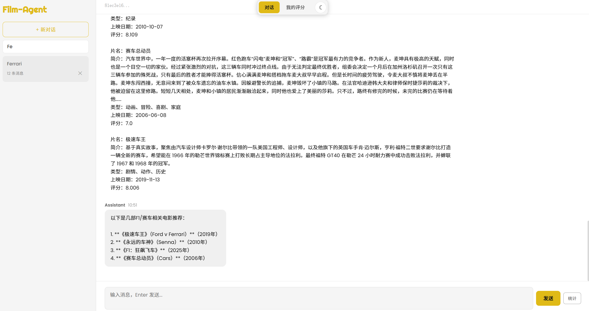

# Film-Agent

AI 驱动的智能电影推荐助手，基于 LangChain + DeepSeek 大模型，支持自然语言对话、豆瓣评分导入、RAG 语义检索与流式输出。

## 功能特性

- **智能对话推荐** — 基于 DeepSeek 大模型，理解用户偏好并推荐电影
- **豆瓣评分导入** — 上传豆瓣 CSV 导出文件，自动同步观影记录与评分
- **用户画像分析** — 根据评分历史分析观影偏好（类型、年代、评分分布）
- **RAG 语义检索** — 基于 ChromaDB + BGE 向量模型，从 TMDB 电影库中检索相关内容
- **流式对话** — SSE 实时流式输出，打字机效果
- **Excel 导出** — 导出对话记录和统计数据为 Excel
- **会话管理** — 多会话支持，搜索、删除、健康检测
- **评分管理** — 评分筛选、排序、编辑、删除、搜索


# 示例界面


## 技术栈

| 层级 | 技术 |
|------|------|
| LLM | DeepSeek (ChatOpenAI 兼容接口) |
| 框架 | FastAPI + LangChain + LangGraph |
| 前端 | Vue 3 + TypeScript + Vite + Pinia |
| 向量库 | ChromaDB + BGE-M3 Embedding |
| 数据库 | MySQL 8.0 + SQLite (checkpoint) |
| 外部 API | TMDB (电影数据)、DeepSeek (对话) |

## 项目结构

```
film-agent/
├── app/
│   ├── main.py                  # FastAPI 入口，挂载前端静态文件
│   ├── config.py                # 环境变量配置 (pydantic-settings)
│   ├── agent/
│   │   ├── core.py              # Agent 核心：初始化 LLM、工具、checkpointer
│   │   ├── tools.py             # TMDB 搜索工具
│   │   ├── user_profile_tool.py # 用户评分画像工具
│   │   └── prompts.py           # System Prompt
│   ├── api/
│   │   └── routes.py            # 全部 API 路由
│   ├── models/
│   │   └── schemas.py           # Pydantic 数据模型
│   ├── rag/
│   │   ├── embeddings.py        # BGE-M3 向量模型封装
│   │   ├── vector_store.py      # ChromaDB 向量存储
│   │   └── retriever_tool.py    # RAG 检索工具 (Agent 可用)
│   ├── services/
│   │   ├── csv_parser.py        # 豆瓣 CSV 解析
│   │   ├── tmdb_enricher.py     # TMDB 数据补充
│   │   ├── movie_store.py       # MySQL 电影/评分 CRUD
│   │   ├── sync_service.py      # 评分导入同步流程
│   │   └── excel_report.py      # Excel 导出
│   ├── db/
│   │   ├── checkpoint.py        # LangGraph SQLite checkpoint & 会话元数据
│   │   └── mysql.py             # MySQL 连接池
│   └── utils/
│       └── logging.py           # 结构化日志
├── frontend/
│   └── src/
│       ├── App.vue              # 根组件 (三栏布局)
│       ├── main.ts              # Vue 入口
│       ├── stores/chat.ts       # Pinia 状态管理
│       ├── api/index.ts         # API 请求封装
│       └── components/
│           ├── ChatPanel.vue    # 对话面板 (消息列表 + 输入框)
│           ├── MessageBubble.vue # 消息气泡 (Markdown 渲染)
│           ├── SessionSidebar.vue # 会话侧边栏 (搜索/新建/删除)
│           └── MyRatings.vue    # 我的评分页 (筛选/排序/编辑/删除)
├── scripts/
│   └── build_index.py           # 离线构建 TMDB 向量索引
├── tests/                       # 14 个测试文件
├── Dockerfile                   # 多阶段构建 (Node + Python)
├── docker-compose.yml           # FastAPI + MySQL 编排
└── requirements.txt             # Python 依赖
```

## 快速开始

### 环境要求

- Python 3.11+
- Node.js 22+
- MySQL 8.0
- TMDB API Key ([申请地址](https://www.themoviedb.org/settings/api))
- DeepSeek API Key ([申请地址](https://platform.deepseek.com))

### 1. 克隆项目

```bash
git clone https://github.com/SabrinaFans-Coder/film-agent.git
cd film-agent
```

### 2. 配置环境变量

```bash
cp .env.example .env
```

编辑 `.env` 填入你的 API Key：

```env
DEEPSEEK_API_KEY=你的DeepSeek密钥
DEEPSEEK_BASE_URL=https://api.deepseek.com/v1
DEEPSEEK_MODEL=deepseek-chat

TMDB_API_KEY=你的TMDB密钥
TMDB_BASE_URL=https://api.themoviedb.org/3

MYSQL_ROOT_PASSWORD=filmagent123
MYSQL_DATABASE=film_agent
MYSQL_USER=filmagent
MYSQL_PASSWORD=filmagent123
MYSQL_HOST=127.0.0.1
MYSQL_PORT=3306
```

### 3. 安装后端依赖

```bash
python -m venv .venv
source .venv/bin/activate   # Windows: .venv\Scripts\activate
pip install -r requirements.txt
```

### 4. 创建数据库

确保 MySQL 运行后，创建数据库：

```sql
CREATE DATABASE film_agent CHARACTER SET utf8mb4 COLLATE utf8mb4_unicode_ci;
```

应用启动时会自动建表。

### 5. 构建向量索引 (可选)

首次使用 RAG 功能需要构建 TMDB 电影向量索引：

```bash
python scripts/build_index.py
```

该脚本从 TMDB 拉取各分类热门电影，生成向量存入 `data/chroma/`。

### 6. 安装前端依赖 & 构建

```bash
cd frontend
npm install
npm run build     # 构建到 frontend/dist/
cd ..
```

### 7. 启动

```bash
uvicorn app.main:app --host 0.0.0.0 --port 8000 --reload
```

访问 `http://localhost:8000` 即可使用。

## Docker 部署

```bash
docker compose up -d
```

自动启动 FastAPI + MySQL 两个容器，访问 `http://localhost:8000`。

> 详细部署说明见 [docs/DEPLOY.md](docs/DEPLOY.md)

## API 文档

启动后访问 `http://localhost:8000/docs` 查看 Swagger 文档。

### 核心接口

| 方法 | 路径 | 说明 |
|------|------|------|
| POST | `/chat` | 发送消息，返回 AI 回复 |
| GET | `/chat/stream` | SSE 流式对话 |
| GET | `/sessions` | 获取会话列表 |
| GET | `/sessions/{id}/messages` | 获取会话历史 |
| DELETE | `/sessions/{id}` | 删除会话 |
| GET | `/export/session/{id}` | 导出对话为 Excel |
| GET | `/export/stats` | 导出统计数据为 Excel |
| POST | `/api/ratings/import` | 导入豆瓣 CSV |
| GET | `/api/ratings` | 查询评分列表 (支持筛选/排序/搜索) |
| PUT | `/api/ratings/{imdb_id}` | 更新评分或评价 |
| DELETE | `/api/ratings/{imdb_id}` | 删除评分记录 |
| GET | `/health` | 健康检查 |

## 运行测试

```bash
pytest tests/ -v
```

## 使用说明

### 基础对话

直接在对话框中输入你想看的电影类型、导演、演员等，Agent 会自动调用 TMDB 搜索工具查询电影信息。

示例：
- "推荐几部诺兰的科幻电影"
- "最近有什么好看的悬疑片"
- "有没有类似《肖申克的救赎》的电影"

### 导入豆瓣评分

1. 登录豆瓣 → 我的 → 电影 → 看过 → 导出 CSV
2. 在侧边栏点击「我的评分」→ 上传 CSV 文件
3. 系统自动解析、补充 TMDB 数据、生成向量索引
4. 导入后可使用偏好分析功能

### 偏好分析

导入评分后，可以问：
- "根据我的评分推荐电影"
- "分析我的观影偏好"
- "我评分最高的电影有哪些"

Agent 会调用用户画像工具，分析你的评分历史并给出个性化推荐。

### 后续开发
Echart图表生成、优化对话丢失BUG

## License

MIT

# Film-Agent

AI 驱动的智能电影推荐助手，基于 LangChain + DeepSeek 大模型，支持自然语言对话、豆瓣评分导入、RAG 语义检索与流式输出。

## 功能特性

- **智能对话推荐** — 基于 DeepSeek 大模型，理解用户偏好并推荐电影
- **豆瓣评分导入** — 上传豆瓣 CSV 导出文件，自动同步观影记录与评分
- **用户画像分析** — 根据评分历史分析观影偏好（类型、年代、评分分布）
- **RAG 语义检索** — 基于 ChromaDB + BGE 向量模型，从 TMDB 电影库中检索相关内容
- **流式对话** — SSE 实时流式输出，打字机效果
- **Excel 导出** — 导出对话记录和统计数据为 Excel
- **会话管理** — 多会话支持，搜索、删除、健康检测
- **评分管理** — 评分筛选、排序、编辑、删除、搜索

## 技术栈

| 层级 | 技术 |
|------|------|
| LLM | DeepSeek (ChatOpenAI 兼容接口) |
| 框架 | FastAPI + LangChain + LangGraph |
| 前端 | Vue 3 + TypeScript + Vite + Pinia |
| 向量库 | ChromaDB + BGE-M3 Embedding |
| 数据库 | MySQL 8.0 + SQLite (checkpoint) |
| 外部 API | TMDB (电影数据)、DeepSeek (对话) |

## 项目结构

```
film-agent/
├── app/
│   ├── main.py                  # FastAPI 入口，挂载前端静态文件
│   ├── config.py                # 环境变量配置 (pydantic-settings)
│   ├── agent/
│   │   ├── core.py              # Agent 核心：初始化 LLM、工具、checkpointer
│   │   ├── tools.py             # TMDB 搜索工具
│   │   ├── user_profile_tool.py # 用户评分画像工具
│   │   └── prompts.py           # System Prompt
│   ├── api/
│   │   └── routes.py            # 全部 API 路由
│   ├── models/
│   │   └── schemas.py           # Pydantic 数据模型
│   ├── rag/
│   │   ├── embeddings.py        # BGE-M3 向量模型封装
│   │   ├── vector_store.py      # ChromaDB 向量存储
│   │   └── retriever_tool.py    # RAG 检索工具 (Agent 可用)
│   ├── services/
│   │   ├── csv_parser.py        # 豆瓣 CSV 解析
│   │   ├── tmdb_enricher.py     # TMDB 数据补充
│   │   ├── movie_store.py       # MySQL 电影/评分 CRUD
│   │   ├── sync_service.py      # 评分导入同步流程
│   │   └── excel_report.py      # Excel 导出
│   ├── db/
│   │   ├── checkpoint.py        # LangGraph SQLite checkpoint & 会话元数据
│   │   └── mysql.py             # MySQL 连接池
│   └── utils/
│       └── logging.py           # 结构化日志
├── frontend/
│   └── src/
│       ├── App.vue              # 根组件 (三栏布局)
│       ├── main.ts              # Vue 入口
│       ├── stores/chat.ts       # Pinia 状态管理
│       ├── api/index.ts         # API 请求封装
│       └── components/
│           ├── ChatPanel.vue    # 对话面板 (消息列表 + 输入框)
│           ├── MessageBubble.vue # 消息气泡 (Markdown 渲染)
│           ├── SessionSidebar.vue # 会话侧边栏 (搜索/新建/删除)
│           └── MyRatings.vue    # 我的评分页 (筛选/排序/编辑/删除)
├── scripts/
│   └── build_index.py           # 离线构建 TMDB 向量索引
├── tests/                       # 14 个测试文件
├── Dockerfile                   # 多阶段构建 (Node + Python)
├── docker-compose.yml           # FastAPI + MySQL 编排
└── requirements.txt             # Python 依赖
```

## 快速开始

### 环境要求

- Python 3.11+
- Node.js 22+
- MySQL 8.0
- TMDB API Key ([申请地址](https://www.themoviedb.org/settings/api))
- DeepSeek API Key ([申请地址](https://platform.deepseek.com))

### 1. 克隆项目

```bash
git clone https://github.com/SabrinaFans-Coder/film-agent.git
cd film-agent
```

### 2. 配置环境变量

```bash
cp .env.example .env
```

编辑 `.env` 填入你的 API Key：

```env
DEEPSEEK_API_KEY=你的DeepSeek密钥
DEEPSEEK_BASE_URL=https://api.deepseek.com/v1
DEEPSEEK_MODEL=deepseek-chat

TMDB_API_KEY=你的TMDB密钥
TMDB_BASE_URL=https://api.themoviedb.org/3

MYSQL_ROOT_PASSWORD=filmagent123
MYSQL_DATABASE=film_agent
MYSQL_USER=filmagent
MYSQL_PASSWORD=filmagent123
MYSQL_HOST=127.0.0.1
MYSQL_PORT=3306
```

### 3. 安装后端依赖

```bash
python -m venv .venv
source .venv/bin/activate   # Windows: .venv\Scripts\activate
pip install -r requirements.txt
```

### 4. 创建数据库

确保 MySQL 运行后，创建数据库：

```sql
CREATE DATABASE film_agent CHARACTER SET utf8mb4 COLLATE utf8mb4_unicode_ci;
```

应用启动时会自动建表。

### 5. 构建向量索引 (可选)

首次使用 RAG 功能需要构建 TMDB 电影向量索引：

```bash
python scripts/build_index.py
```

该脚本从 TMDB 拉取各分类热门电影，生成向量存入 `data/chroma/`。

### 6. 安装前端依赖 & 构建

```bash
cd frontend
npm install
npm run build     # 构建到 frontend/dist/
cd ..
```

### 7. 启动

```bash
uvicorn app.main:app --host 0.0.0.0 --port 8000 --reload
```

访问 `http://localhost:8000` 即可使用。

## Docker 部署

```bash
docker compose up -d
```

自动启动 FastAPI + MySQL 两个容器，访问 `http://localhost:8000`。

> 详细部署说明见 [docs/DEPLOY.md](docs/DEPLOY.md)

## API 文档

启动后访问 `http://localhost:8000/docs` 查看 Swagger 文档。

### 核心接口

| 方法 | 路径 | 说明 |
|------|------|------|
| POST | `/chat` | 发送消息，返回 AI 回复 |
| GET | `/chat/stream` | SSE 流式对话 |
| GET | `/sessions` | 获取会话列表 |
| GET | `/sessions/{id}/messages` | 获取会话历史 |
| DELETE | `/sessions/{id}` | 删除会话 |
| GET | `/export/session/{id}` | 导出对话为 Excel |
| GET | `/export/stats` | 导出统计数据为 Excel |
| POST | `/api/ratings/import` | 导入豆瓣 CSV |
| GET | `/api/ratings` | 查询评分列表 (支持筛选/排序/搜索) |
| PUT | `/api/ratings/{imdb_id}` | 更新评分或评价 |
| DELETE | `/api/ratings/{imdb_id}` | 删除评分记录 |
| GET | `/health` | 健康检查 |

## 运行测试

```bash
pytest tests/ -v
```

## 使用说明

### 基础对话

直接在对话框中输入你想看的电影类型、导演、演员等，Agent 会自动调用 TMDB 搜索工具查询电影信息。

示例：
- "推荐几部诺兰的科幻电影"
- "最近有什么好看的悬疑片"
- "有没有类似《肖申克的救赎》的电影"

### 导入豆瓣评分

1. 登录豆瓣 → 我的 → 电影 → 看过 → 导出 CSV
2. 在侧边栏点击「我的评分」→ 上传 CSV 文件
3. 系统自动解析、补充 TMDB 数据、生成向量索引
4. 导入后可使用偏好分析功能

### 偏好分析

导入评分后，可以问：
- "根据我的评分推荐电影"
- "分析我的观影偏好"
- "我评分最高的电影有哪些"

Agent 会调用用户画像工具，分析你的评分历史并给出个性化推荐。

## License

MIT
